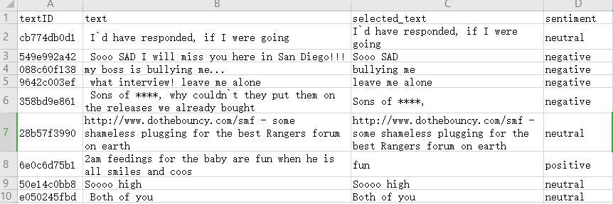

# 推文情绪分析与预测

## [摘要]

## 1、项目概述

## 2、数据准备

在我们的项目中，我们的数据来源于全球知名的机器学习竞赛网站，总共包含27000余条数据，每条数据分为textID，text，selected_text，sentiment四个字段，分别指推文id，内容，包含情感倾向的文本和标注的情感。

在我们的项目中，我们将这个数据集分为train.csv和test.csv两个数据集，其中train.csv数据来构造模型，并预测test.csv数据。

## 3、模型训练

## 4、模型评估

## 5、模型优化

## 6、应用与测试

## 7、总结

## 8、参考文献

- [1](https://blog.csdn.net/qq_30232405/article/details/105575473)

- [2](https://blog.csdn.net/qq_30232405/article/details/105686636)

- [3](https://www.jianshu.com/p/188b65a42eea)

